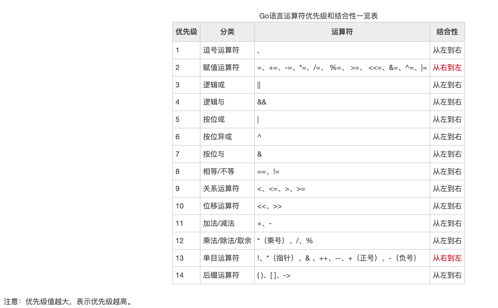
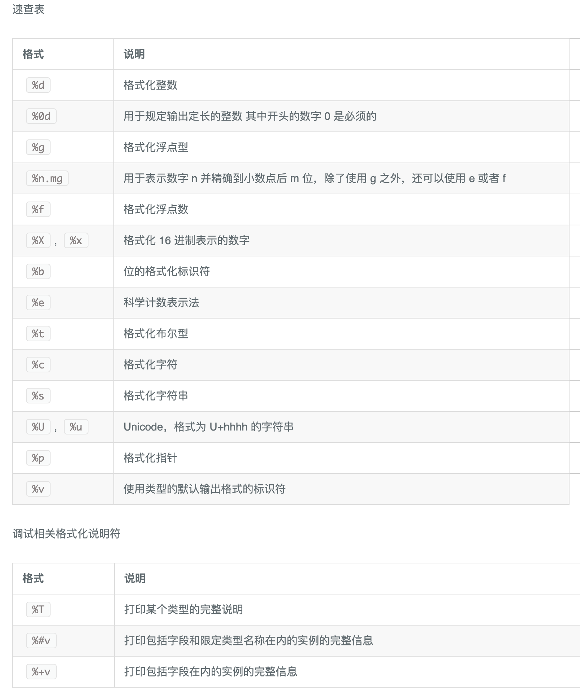
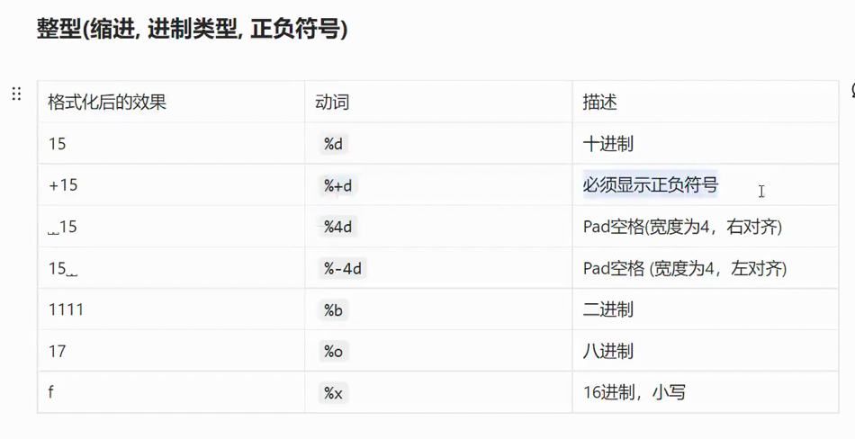
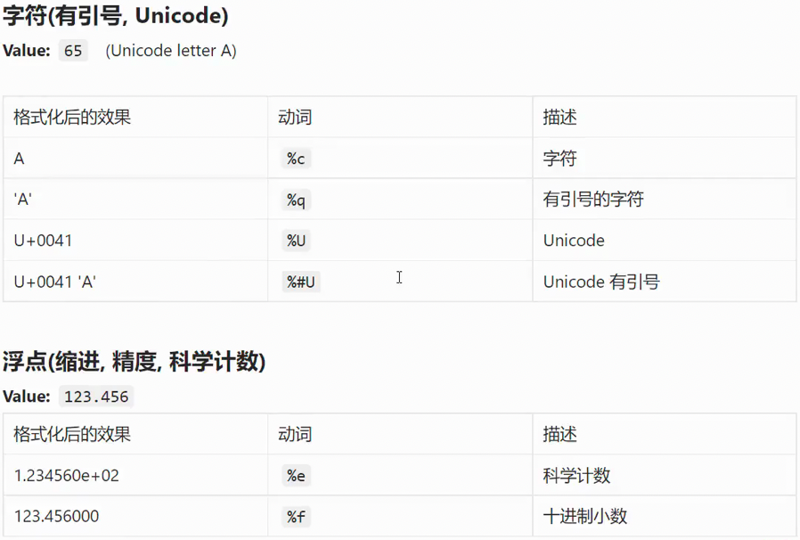
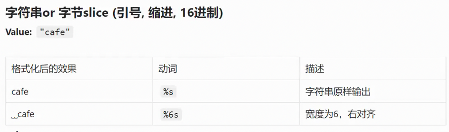
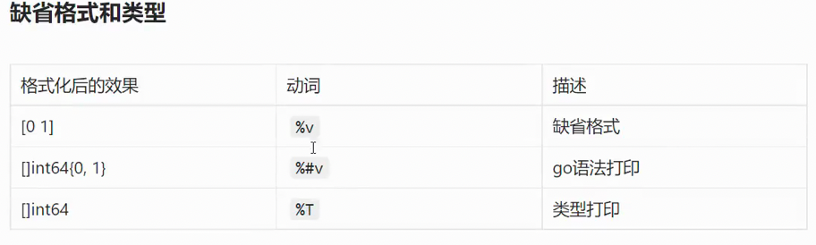

# go

## 1. go中的变量

--- 

```go
package main

import "fmt"

// 全局变量和局部变量
var (
	name = "bobby"
	age  = 18
	ok   bool
)
var ssan = 2

func main() {
	//go是静态语言，静态语言和动态语言相比变量差异很大
	//1. 变量必须先定义后使用 2. 变量必须有类型 3. 类型定下来后不能改变
	//定义变量的方式
	//var name int
	//name = 1

	//var age = 1
	age := 1
	var age2 int

	//go语言中变量定义了不使用是不行的
	fmt.Println(age, age2)

	//2. 多变量定义
	var user1, user2, user3 = "bobby1", 1, "bobby3"
	fmt.Println(user1, user2, user3)

	/*
		注意：
			变量必须先定义才能使用
			go语言是静态语言，要求变量的类型和赋值类型一致
			变量名不能冲突
			简洁变量定义不能用于全局变量
			变量是有零值,也就是默认值
			定义了变量一定要使用，否则会报错
	*/
}
```

## 2. go中的常量

--- 

```go
package main

import "fmt"

func main() {
	const (
		//常量， 定义的时候就指定的值，不能修改， 常量尽量全部大写
		PI  float32 = 3.1415926 //显式定义
		PI2 float32 = 3.12323234
	)

	const (
		UNKNOWN = 1
		FEMALE  = 2
		MALE    = 3
	)

	const (
		x int = 16
		y
		s = "abc"
		z
		m
	)
	fmt.Println(x, y, s, z, m)

	/*
		常量类型只可以定义bool、数值(整数、浮点数和复数) 和 字符串
		不曾使用的常量， 没有强制使用的要求
		显示指定类型的时候，必须确保常量左右值类型一致
	    在列表定义中，如果不赋值则采用前一个常量的值
	*/
}

```

## 3. iota

---

```go
package main

import "fmt"

func main() {
	//	iota 特殊常量 可以认为是一个可以北边一起修改的变量
	// 列入 使用 const 声明常量错误码 要在中间 插入一个错误码时，需要将后续的值都改一遍会很麻烦
	//const (
	//	ERR1 = 1
	//	ERR2 = 2
	//	ERR3 = 3
	//	ERR4 = 4
	//)

	//const (
	//	ERR1 = iota
	//	ERR2
	//	ERR3
	//	ERR4
	//)
	// iota 不会规定类型 如果中断了 iota 则需要 显示的赋值 后续会自动递增
	//自增类型默认是 int 类型
	const (
		ERR1 = iota
		ERR2
		ERR21 = "haha"
		ERR22 = "haha"
		ERR23 = 100
		ERR3  = iota
		ERR4
	)
	//0 1 haha haha 5 6
	//每次出现const iota 归零
	const (
		ERRNEW1 = iota
		ERRNEW2
		ERRNEW21 = "haha"
		ERRNEW22 = "haha"
		ERRNEW23 = 100
		ERRNEW3  = iota
		ERRNEW4
	)
	// 0 1 haha haha 100 5 6
	fmt.Println(ERR1, ERR2, ERR3, ERR4)
}

```

## 4. go中的匿名变量与作用域

--- 

```go
package main

var _ int

func a(int, bool) (int, bool) {
	return 0, false
}

func main() {
	_, ok := a(0, false)
	// 此处只需要使用 ok 变量 匿名变量 相当于占位一样 不使用 不会报错
	if ok {

	}
}

/**
变量的作用域

全局变量 任何地方都可以用到

函数内部定义的变量 在函数内部可以使用，出了函数就不可以使用了
{

} 双花括号内也可以写代码语句，代码块内部的变量 外部不可以使用
*/

```
## 5.go中的基本数据类型

---

- `bool`
- 数值类型
  - 整数
  - 浮点数
  - 复数
  - `byte`
  - `rune` 
- 字符和 `string`

### 5.1 bool类型
布尔型的值只可以是常量 `true` 或者 `false` 。一个简单的例子: `var b bool = true`
### 5.2 数值型
#### 5.2.1 整数型
可以简单讲解一下二进制和位数的关系,以及 `int` 和 `uint` 的关系
- `int` 类型是根据操作系统来定义的，64位的操作系统就是64 32位的操作系统就是32
- `int8` 有符号8位整型(-128到127)长度:8bit
- `int16` 有符号16位整型(-32768到32767)
- `int32` 有符号32位整型(-2147483648到2147483647)
- `int64` 有符号64位整型(-9223372036854775808到92233720336854775807
- `uint8` 无符号8位整型(0到255)8位都用于表示数值:
- `uint16` 无符号16位整型(0到65535)
- `uint32` 无符号32位整型(0到4294967295)
- `uint64` 无符号64位整型(0到18446744073709551615)
#### 5.2.2 浮点型
- `float32` 32位浮点型数 （3.4 * 10 ^ 38）
- `float64` 64位浮点型数（ 1.8 * 10 ^ 308）
#### 5.2.3 其他
- `byte` 等于 `uint8`  主要用于存放字符的ascall码 
- `rune` 等于 `int32`  `byte` 类型表示的字符类型有限, 这个类型也是用来表示字符的. 例如 中文汉字
- 如果处理的字符只是英文字符, 使用 `byte` 就可以, 如果有中文有英文，使用 `rune` 类型

```go
package main

import "fmt"

/*


 */

func main() {
	//var num int8 = 127
	//
	//var f1 float32 = 399.3333

	var c byte

	c = 'a'
	c1 := 97

	fmt.Println(c)        //  97   打印 a 字符的 ASCll 码
	fmt.Printf("c=%c", c) //使用格式化打印 字符串
	fmt.Println(c1)
	fmt.Printf("c1=%c1", c1)
	fmt.Println("")

	var b rune

	b = '木'

	fmt.Println(b)

	var name string = "fooo"

	fmt.Println(name)
}
```

## 6. go中的基本数据类型转换

--- 

 ```go

package main

import (
	"fmt"
	"strconv"
)


func main() {

	// 浮点数
	a := 5.11
	//转换为 整数
	b := int(a)
	fmt.Println(a)
	fmt.Println(b)

	//	go允许在底层结构相同的两个类型之间互转
	//IT类型的底层是int类型

	type IT int

	var c IT = 199

	//将c IT 类型 转换为 int， b现在是 int 类型
	var d int = int(c)
	var e IT = IT(b)

	fmt.Println(e)

	fmt.Println(d)

	//	字符串 转数字
	var str = "12e"
	myInt, error := strconv.Atoi(str)

	if error != nil {
		fmt.Println(error)
		fmt.Println("Atoi error")
	}
	fmt.Println(myInt)

	//数字转字符串

	var num = 998

	mystr := strconv.Itoa(num)

	fmt.Println(mystr)
}

```

## 7.字符串格式化转换

--- 

 ```go
   {
		//字符串转换为float32
		value, error := strconv.ParseFloat("3.11414", 64)

		if error != nil {
			fmt.Println(error)
			fmt.Println("Atoi error")
		}
		fmt.Println(value)
	}

	{
		//字符串转换为int
		//这里 base 参数是指 你的 字符串参数 是 几进制 然后 吧这个 base进制的字符串 转换成bitSize位的十进制数字
		value, error := strconv.ParseInt("11", 2, 64)

		if error != nil {
			fmt.Println(error)
			fmt.Println("Atoi error")
		}
		fmt.Println(value)
	}

	{
		//字符串转换为bool
		//这里 base 参数是指 你的 字符串参数 是 几进制 然后 吧这个 base进制的字符串 转换成bitSize位的十进制数字
		value, error := strconv.ParseBool("0")
		// "0"  -> false   "1" -> true   "true" -> true  否则就是 false
		if error != nil {
			fmt.Println(error)
			fmt.Println("Atoi error")
		}
		fmt.Println(value)
	}

	{
		//基本类型转字符串
		value := strconv.FormatBool(true)
		fmt.Println(value)
	}

	{
		//基本类型转字符串
		value := strconv.FormatFloat(3.141555, 'f', -1, 64)
		fmt.Println(value)
	}

	{
		//基本类型转字符串
		value := strconv.FormatInt(42, 16)
		fmt.Println(value)
	}
```
 
## 8. 特殊运算符

--- 

```go
var A = 1
c := &A // 代表取 A 变量的地址 

var C *int //指针类型
```


## 9.字符串

---

### 9.1 rune 和 字符串长度

---

```go
package main

import "fmt"

func main() {
	//长度计算
	name := "fooo中文"
	fmt.Println(len(name)) // 10  len 返回的是字符串的字节数 一个中文 占 三个字节

	//切片
	bytes := []byte(name)

	fmt.Println(bytes)
	fmt.Println(len(bytes))

	//字符长度, 如果 字符串中有中文，需要转换成 rune 类型

	runes := []rune(name)

	fmt.Println(runes)
	fmt.Println(len(runes)) // 6

	//单引号 和 双引号  单引号包裹的是byte类型或者rune类型  双引号包裹的才是字符串类型
	age := "年"
	var c byte = 'c'
	d := '年' // rune 类型

	fmt.Println(age)
	fmt.Println(c)
	fmt.Println(d)
}

```

### 9.2 转义符

---

```go
package main

import "fmt"

func main() {


	//转义符

	name := "张\"\r\n三\"" // \r \n  回车换行

	fmt.Println(name) //张"
	                  //三"  
	name1 := `张"三"111`
	
	fmt.Println(name1)//张"三"

}

```
 
### 9.3 格式化输出

---

```go
package main

import (
	"fmt"
	"strconv"
)

func main() {

	//格式化输出

	name := "foo"
	age := 18
	address := "北京 "
	fmt.Println("用户名：" + name + ",  年龄：" + strconv.Itoa(age) + ",  地址：" + address) //拼凑 字符串 很难维护

	fmt.Printf("用户名：%s, 年龄：%d, 地址：%s", name, age, address) //这个 很常用 但是 性能没有 上面的好

	useMsg := fmt.Sprintf("\r\nSprintf \r\n用户名：%s, 年龄：%d, 地址：%s", name, age, address) // 生成字符串  Printf 只管打印

	fmt.Println(useMsg)
}

```








 


### 9.4 高性能的字符串拼接 - strings.builder

---

```go
package main

import (
	"fmt"
	"strconv"
	"strings"
)

func main() {


	name := "foo"
	age := 18
	address := "北京 "

	//通过string的buildr进行字符串拼接   高性能

	var builder strings.Builder
	builder.WriteString("用户名:")
	builder.WriteString(name)
	builder.WriteString(",年龄:")
	builder.WriteString(strconv.Itoa(age))
	builder.WriteString(",地址:")
	builder.WriteString(address)

	re := builder.String()

	fmt.Println(re)

}
```


### 9.5 字符串的比较

--- 

```go
package main

import (
	"fmt"
	"strconv"
	"strings"
)

func main() {


  //字符串比较
  a := "a"
  b := "a"

  fmt.Println(a == b)
  fmt.Println(a != b)

  //字符串的 大小比较 从左往右 根据 ascall码 比较 相同就比较下一个的ascall 码

  c := "baello"
  d := "bello"

  fmt.Println(c > d)

}
```

### 9.6 字符串常用的方法

---

```go
package main

import (
	"fmt"
	"strings"
)

func main() {

  name := "fooo-bar"
  //是否包含
  fmt.Println(strings.Contains(name, "bar"))
  //子串出现的次数
  fmt.Println(strings.Count(name, "o"))
  //分割
  fmt.Println(strings.Split(name, "-"))

  //	字符串是否包含前缀  字符串是否包含后缀
  fmt.Println(strings.HasPrefix(name, "fo"))
  fmt.Println(strings.HasSuffix(name, "bar"))

  //查询子串出现的位置
  fmt.Println(strings.Index(name, "-"))

  //替换

  fmt.Println(strings.Replace(name, "fooo", "aaa", -1))

  //大小写 转换
  fmt.Println(strings.ToLower("GGG"))
  fmt.Println(strings.ToUpper("ggg"))

  //去掉字符串 前后的字符
  fmt.Println(strings.Trim("   -wf- w e-  --", " -"))
  
}
```

## 10. if、for、for range、 switch、 goto、语句

--- 

```go
package main

import "fmt"

func main() {

	score := 70

	if score > 80 {
		fmt.Println("良好")
	} else if score > 90 {
		fmt.Println("优秀")
	} else {
		fmt.Println("一般")
	}

	str := "tiantian向上"

	runeStr := []rune(str)
	
	
	//for 中的 break 和 continue 和 js中的用法一样

	for i := 0; i < len(runeStr); i++ {
		fmt.Printf("%c\r\n", runeStr[i])
	}

	for key, value := range runeStr {
		fmt.Printf("%d %c\r\n", key, value)
	}

	switch {
	case score > 80:
		fmt.Println("良好")
	default:
		fmt.Println("一般")
	}

	for i := 0; i < 5; i++ {
		for j := 0; j < 5; j++ {
			fmt.Println(i, j)
			if i == 0 && j == 3 {
				goto over
			}

		}
	}

over:
	fmt.Println("over")
}

```

## 11. 数组

### 11.1 数组的基本使用

---

```go

package main

import "fmt"

func main() {

	// go 语言提供了哪些集合类型的数据结构 数组、 *切片（slice ）、 * map、 list

	//数组   courses1 和 courses2 的类型不一样
	var courses1 [3]string //有3个字符串元素的 数组
	var courses2 [4]string //有4个字符串元素的 数组
	var courses3 []string  // [3]string 和  []string  是两种不一样的类型   [3]string类型 是数组 []string类型是切片

	courses1[0] = "go"
	courses1[1] = "grpc"
	courses1[2] = "gin"

	fmt.Println(courses1)

	fmt.Printf("%T\r\n", courses1) //[3]string
	fmt.Printf("%T\r\n", courses2) //[4]string
	fmt.Printf("%T\r\n", courses3) //[]string

	for _, value := range courses1 {
		fmt.Println(value)
	}

}

```

### 11.2 数组的初始化

---

```go
package main

import "fmt"

func main() {

	// go 语言提供了哪些集合类型的数据结构 数组、 *切片（slice ）、 * map、 list

	//数组   courses1 和 courses2 的类型不一样
	var courses1 [3]string //有3个字符串元素的 数组
	var courses2 [4]string //有4个字符串元素的 数组
	var courses3 []string  // [3]string 和  []string  是两种不一样的类型   [3]string类型 是数组 []string类型是切片

	courses1[0] = "go"
	courses1[1] = "grpc"
	courses1[2] = "gin"

	fmt.Println(courses1)

	fmt.Printf("%T\r\n", courses1) //[3]string
	fmt.Printf("%T\r\n", courses2) //[4]string
	fmt.Printf("%T\r\n", courses3) //[]string

	for _, value := range courses1 {
		fmt.Println(value)
	}

	//数组的初始化
	courses4 := [3]string{"go", "grpc", "gin"}

	fmt.Println(courses4)

	courses5 := [3]string{2: "gin"} //没有初始化的位置 是 "" 空字符串
	for _, value := range courses5 {
		fmt.Println(value == "")
	}
	fmt.Println(courses5)

	courses6 := [...]string{"go", "grpc", "gin"} //初始化是几个  类型长度就是几
	fmt.Printf("%T\r\n", courses6)               //[3]string
	fmt.Println(courses5


  if courses4 == courses6 { //比较是比较数组的每一项是否相等
    fmt.Println("equal")
  }

  // 多维数组
  var courses7 = [2][2]string{{"go", "1h"}, {"grpc", "2h"}}
  fmt.Println(courses7)
}

```

## 12.切片

---

```go
package main

import "fmt"

func main() {
	

  //切片
  var courses8 []string

  //append的用法   往 courses8 中 添加 元素 必须使用 courses8 接受
  courses8 = append(courses8, "go")
  courses8 = append(courses8, "grpc")
  //切片的初始化  3 种
  //1.从数组直接创建 2.使用 string{} 3. make
  //1.从数组创建切片
  allCourses4 := [5]string{"go", "grpc", "gin", "mysql", "elasticsearch"}

  allCourses4Slice := allCourses4[0:1]

  fmt.Println(allCourses4Slice)
  fmt.Printf("%T\r\n", allCourses4Slice)

  //2. 直接创建切片   allCourses4 := []string{"go", "grpc", "gin", "mysql", "elasticsearch"}

  //3. make函数
  allCourses4SliceForMake := make([]string, 3)
  allCourses4SliceForMake[0] = "c"
  allCourses4SliceForMake[1] = "c"
  allCourses4SliceForMake[2] = "c"
  //allCourses4SliceForMake[3] = "c"  使用make 创建切片 超过初始化长度 回报错
  fmt.Println(allCourses4SliceForMake)

  //tips:

  var allCoursesNoLength []string

  //allCoursesNoLength[0] = "c"  如果slice 没有声明初始化长度 这样赋值 会报错
  //需要使用append方法
  allCoursesNoLength = append(allCoursesNoLength, "c")

  fmt.Println(allCoursesNoLength)

  // 切片的访问 访问单个  访问多个
  allCourses := []string{"go", "grpc", "gin", "mysql", "elasticsearch"}

  fmt.Println(allCourses[0])
  fmt.Println(allCourses[1:4])
  fmt.Println(allCourses[1:]) // 只有 start  没有end  表示 取到完
  fmt.Println(allCourses[:3]) //只有end  表示 取到 开头
  fmt.Println(allCourses[:])  //没有 start 没有 end  表示 复制了一份

  //切片的数据 添加

  allCoursesForAdd := []string{"go", "grpc"}
  allCoursesForAdd2 := []string{"mysql", "es"}

  //allCoursesForAdd = append(allCoursesForAdd, "gin", "mysql", "es ")

  //方法1 for 循环合并
  //for _, value := range allCoursesForAdd2 {
  //	allCoursesForAdd = append(allCoursesForAdd, value)
  //}

  //方法2 ...  合并
  allCoursesForAdd = append(allCoursesForAdd, allCoursesForAdd2[1:]...)

  fmt.Println(allCoursesForAdd)


  //切片元素的删除和拷贝

  //删除 比较麻烦

  allCourses1 := []string{"go", "grpc", "gin", "mysql", "elasticsearch"}

  mySlice := append(allCourses1[0:2], allCourses1[3:]...)
  fmt.Println(mySlice)

  mySlice1 := allCourses1[:3]
  fmt.Println(mySlice1)

  //复制 实际上 只是 指向了 同一个数据  没有做拷贝
  mySliceCopy := allCourses1[:]
  //allCourses1[0] = "java"   // 例如 我改变了 allCourses1的第一项  但是 mySliceCopy的第一项也会被改变
  fmt.Println(allCourses1)
  fmt.Println(mySliceCopy)

  //拷贝
  //var mySliceDeepCopy []string 这样声明 是没有长度的， 拷贝不会将长度也拷贝上
  var mySliceDeepCopy = make([]string, len(allCourses1))
  copy(mySliceDeepCopy, allCourses1)
  fmt.Println(mySliceDeepCopy)

  fmt.Println("----")
  allCourses1[0] = "java" // 例如 我改变了 allCourses1的第一项  但是 mySliceCopy的第一项也会被改变,经过copy的切片不会被修改
  fmt.Println(allCourses1)
  fmt.Println(mySliceCopy)
  fmt.Println(mySliceDeepCopy)

}

```


## 13. Map

--- 

```go
package main

import (
	"fmt"
)

func main() {
	var courseMap = map[string]string{
		"go":   "go工程师",
		"grpc": "grpc入门",
		"gin":  "gin深入理解",
	}

	// 取值
	fmt.Println(courseMap["grpc"])

	//放值
	courseMap["mysql"] = "mysql的原理"

	fmt.Println(courseMap)

	/**
	var nilMap map[string]string //  只定义 初始值 是 nil
	// 如果一个map 没有初始化 这样赋值会报错
	nilMap["mysql"] = "mysql"
	*/

	//var nilMap = map[string]string{}

	var nilMap = make(map[string]string) //make 是内置函数， 主要用于slice map channel的初始化

	nilMap["mysql"] = "mysql" //需要这样初始化才不会报错
	nilMap["mysql1"] = "mysql1"
	nilMap["mysql2"] = "mysql2"
	nilMap["mysql3"] = "mysql3"

	fmt.Println(nilMap)

	//	遍历 map结构是无序的  每次遍历的顺序是不一样的

	for key, value := range courseMap {
		fmt.Printf("key: %s, value: %s \r\n", key, value)
	}

	//	courseMap 判断是否存在 java属性
	_, ok := courseMap["java"]
	if !ok {
		fmt.Println("not in")
	} else {
		fmt.Println("in")
	}

	//	删除元素

	delete(courseMap, "grpc")
	fmt.Println(courseMap)

	//	map不是线程安全的 两个协程 对map操作的话会报错 需要使用
	//var syncMap = sync.Map{}

	//fmt.Println(syncMap)

}

```
## 14. 函数

---


```go
package main

import (
	"errors"
	"fmt"
	"sync"
)

func main() {
	//go函数支持普通函数、匿名函数、闭包

	/*
			go中函数是"一等公民"
			1. 函数本身是可以当作变量
			2. 匿名函数 闭包
			3. 函数是可以满足接口的

		函数参数传递的时候，值传递，引用传递，go语言中全部是值传递
	*/

	sum, _ := add(1, 10)
	fmt.Println(sum)

	sum1, _ := add1(1, 10, 10)
	fmt.Println(sum1)

	var testMap = map[string]string{
		"mysql": "111",
	}
	test(testMap)

	fmt.Println(testMap) // map[mysql:test]

	//defer  链接数据库、打开文件、开始锁， 无论如何 最后都要记得去关闭数据库、关闭文件、解锁
	var mu sync.Mutex

	mu.Lock()
	defer mu.Unlock() //defer后面的代码是会放在return之前执行的 多个defer的话， 是和栈一样的概念，先进后执行

	A()

}

// func add(a, b int) int {  参数的类型一样可以简写
//func add(a int, b int) (int, error) {
//	return a + b, nil
//}

func add(a int, b int) (sum int, err error) { //如果这里定义好变量名称的话 return 语句后面可以不写

	sum = a + b
	//return sum, err
	return
}

func test(a map[string]string) {
	a["mysql"] = "test"
}

// 不定参数列表
func add1(items ...int) (sum int, err error) {

	for _, val := range items {
		sum += val
	}
	return
}

//go语言错误处理的理念,
//error panic  recover
//一个函数可能出错,trycatch去包住这个函数,
//11开发函数的人需要有一个返回值去告诉调用者是否成功,
////go设计者认为必须要处理这个error,防御编程
//go设计者要求我们必须要处理这个err,代码中大量的会出现iferr!=nil

func A() (int, error) {
	//panic("this is an panic")//panic会导致程序的退出4,平时开发中不要随便用,一般我们在哪里用到:我们一个服务各启动的过程中
	//比如我的服务想要启动,必须有些依赖服务准备好,日志文件存在、mysql能链接通、比如配置文件没有问题,这个时候服务方能启动的时候
	//如果我们的服务启动检查中发现了这些任何一个不满足那就调用panic主动调用
	//但是你的服务一旦启动了,这个时候你的某行代码中不小心心panic那么不好意思你的程序挂了,这是重大事故
	//但是架不住有些地方我们的代码写的不小心会导致被动触力panic   例如 map 不初始化 就赋值
	//recover这个函数能捕获到panic

	defer func() {
		if r := recover(); r != nil {
			fmt.Println(r)
		}
	}()

	var names map[string]string
	names["go"] = "go工程师"
	//fmt.Println("this is a func")
	return 0, errors.New("this is an error")

	/**
	//1.defer需要放在panic之前定义,另外 recover只有在defer调用的函数中才会生效
	//2.recover处理异常后,逻辑并不会恢复到panic的那个点去
	//3.多个defer会形成栈,后定义的defer会先执行
 
	*/
}

```


## 15 结构体

---

```go
package main

import "fmt"

func main() {
	/**
	type关键字
	1.定义结构体
	2.定义接口
	3.定义类型别名
	4.类型定义
	5.类型判断
	*/

	var a byte = 'A'

	fmt.Printf("%T", a)

	//	结构体

	type Person struct {
		name    string
		age     uint8
		address string
		height  float32
	}

	p1 := Person{"fofo", 23, "北京", 1.80} // 这种初始化方式 必须全部赋值
	//p2 := Person{
	//	name:    "bobo",
	//	age:     19,
	//	address: "北京",
	//	height:  1.89,
	//} // 这种方式更灵活

	//初始化 与 赋值
	var persons []Person
	persons = append(persons, p1)
	persons = append(persons, Person{
		name: "bobby3",
	})
	//persons2 := []Person{
	//	{name: "bobby1", age: 18, address: "wfwef", height: 1.80},
	//	{
	//		age: 19,
	//	},
	//}

	//匿名结构体  取值
	var p Person
	p.age = 20
	fmt.Println(p.height)
	//匿名结构体
	address := struct {
		province string
		city     string
		address  string
	}{
		province: "北京市",
		city:     "通州区",
		address:  "xxx"}
	fmt.Println(address.city)

	//s := Student{
	//	p: Person{
	//		name: "bobby", age: 18,
	//	},
	//	score: 95.6,
	//}

	s := Student{
		Person1: Person1{name: "ssss", age: 233},
		score:   95.6,
		name:    "fwefwefw",
	}
	s.printss()

	s2 := Student{
		Person1{name: "ssss", age: 23},
		95.6,
		"fofofofo", //里面和外面同时 有一样的字段时  外面的优先级高
	}
	fmt.Println(s.age)
	fmt.Println(s2.age)
	fmt.Println(s2.name) // fofofof

}

type Person1 struct {
	name string
	age  uint8
}
type Student struct {
	//第一种嵌套方式
	//p     Person
	Person1 //匿名写法
	score   float32
	name    string
}

// 接收器的形态有两种
// 指针形态是引用传递  非指针形态是值传递
func (p *Student) printss() {
	//有可能该函数中想要改p的值,就是person对象很大,数据较大的时候考虑使用指针方式

	p.age = 19
	fmt.Printf("name:%s, age:%d", p.name, p.age)
}
```